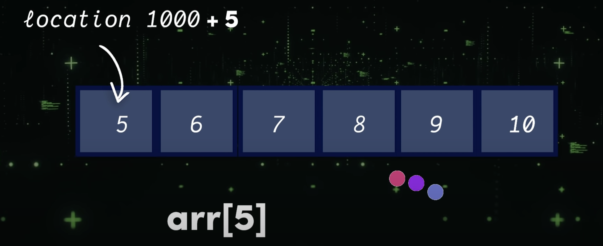

# Arrays
The array is a continuous block of cells in the computer's memory. 

By keeping track of it's memory location, it can instantly compute the location of any item inside of it.

**Pros** 
<ul>
  <li> Retrieving items
</ul>

**Cons** 
<ul>
  <li> Adding items
</ul>

---

