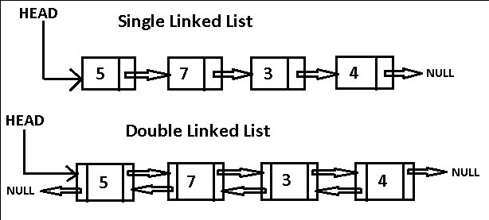

# Linked Lists
A linked list is made of of nodes. 

**Node** -
Contains a value and a pointer

Each node stores an item of data, and has a referance to the next node on the list (a pointer).

---

**Pros:**
<ul>
  <li> Adding new items
  <li> Deleting items
</ul>

**Cons:**
<ul>
  <li> Retrieval
  <li> Searching
</ul>

---

If you're adding things to the end of a list, the link goes from the existing node to the new node. If you're adding things to the start of the list, you can create a new node, and just point it to the first item of the list.

### Singly Linked Lists
A linked list with a single link to each node on the list.

### Doubly Linked Lists
A linked list has a link to both to the next node and the previous node.

---

The difference between an array and a linked list is the fact that, with arrays you can find an item using it's index. With linked lists, you need to go through the list to find a specific node, as it is stored in an arbitrary place in memory.

E.g.... For the 10th thing, you need to follow 10 links.

---

**Head** = Node at the start of the list that points to everything after. 
 
**Tail** = Node at the end of the list that the previous one is pointing to , but it itself is pointing to nowhere.

---

You need to keep track of at least t he head, the tail is optional.

Point the tail of the linked list to **null**, so you know it is the last item of the list. If you need to add something to the end of the list, you'll need to point the current tail to the new node instead of null, and the new node to null.

--- 

If you need to add something to the middle of the list, you need to break a current link between nodes and make two new links, each pointing to the new node.

In an array, you'd need to shift all prior items in the array to the right, and insert the new one. Taking n numbers of iterations.

---

## **Examples** 

### Doubly Linked Lists
The back and forward buttons on the browser. Or the undo and redo buttons on some type of editor.

